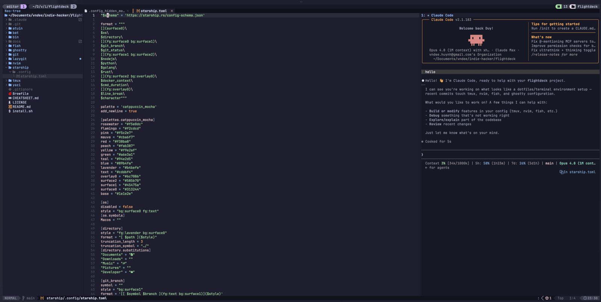
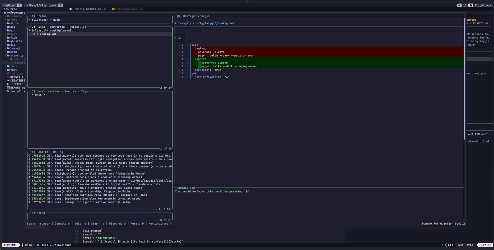
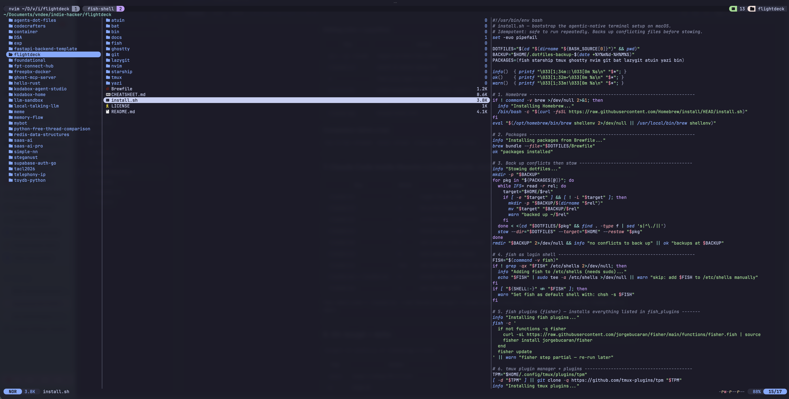
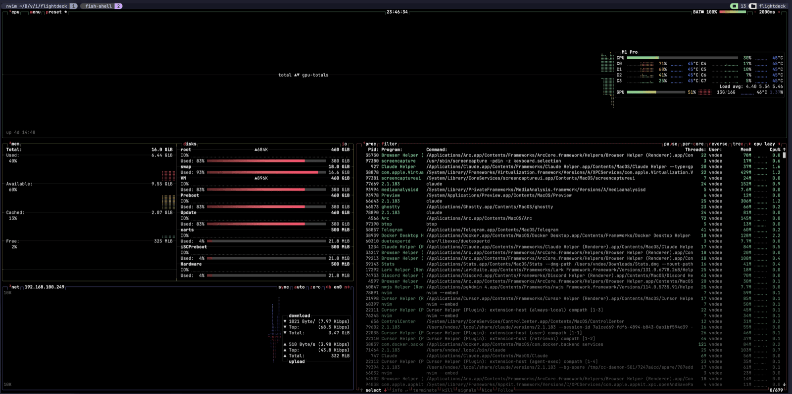

# flightdeck ✈️

> Your **agentic cockpit** in the terminal — an IDE-free macOS dev environment
> where AI agents are first-class. Ghostty · fish · tmux · Neovim (LazyVim) ·
> Claude Code, themed Catppuccin Mocha and managed with GNU Stow.

Built for a workflow where AI agents are first-class: run several Claude Code
agents in parallel on isolated git worktrees, or drive one from inside Neovim.

|  |  |
|:---:|:---:|
| [](assets/cockpit.png) | [](assets/lazygit.png) |
| **Neovim + Claude Code** — the agentic cockpit | **lazygit** — git TUI (`prefix g`) |
| [](assets/yazi.png) | [](assets/btop.png) |
| **yazi** — file manager (`y`) | **btop** — system monitor (`top`) |

## Stack

| Layer | Tool |
|---|---|
| Terminal | [Ghostty](https://ghostty.org) — GPU, native macOS |
| Shell | [fish](https://fishshell.com) + [Starship](https://starship.rs) prompt |
| Multiplexer | [tmux](https://github.com/tmux/tmux) + [sesh](https://github.com/joshmedeski/sesh) + tpm plugins |
| Editor | [Neovim](https://neovim.io) + [LazyVim](https://lazyvim.org) |
| Agent | [Claude Code](https://claude.com/claude-code) + `wt` worktrees + [claudecode.nvim](https://github.com/coder/claudecode.nvim) |
| CLI core | fzf · fd · ripgrep · bat · eza · zoxide · git-delta · lazygit · yazi · atuin · btop · glow · gh |
| Theme | Catppuccin Mocha (everywhere) |

## Install

```bash
git clone https://github.com/vndee/flightdeck ~/flightdeck
cd ~/flightdeck
./install.sh          # installs Homebrew packages, stows configs, sets up plugins
chsh -s "$(command -v fish)"   # make fish your login shell
```

`install.sh` is idempotent and backs up any conflicting files to
`~/.dotfiles-backup-<timestamp>/` before symlinking.

## Run several projects at once

The move I reach for most when juggling repos: **two independent tab layers**, one
nested in the other — so a dozen projects and their agents all stay live.

- **Outer — Ghostty tabs = projects.** `⌘T` new tab · `⌘1`…`⌘8` jump · `⌘9` last ·
  `⌘⇧[` / `⌘⇧]` cycle. One macOS-native tab per repo/client.
- **Inner — tmux = that project's cockpit.** Each tab holds a tmux session of
  windows (editor, Claude agents) and panes. `Ctrl-a 1/2` jump windows,
  `Ctrl-a T` fuzzy-switch sessions (sesh), `wt <branch>` spins an isolated agent.

```text
 ⌘1 api          ⌘2 web          ⌘3 infra        ← Ghostty tabs = projects
 ┌─────────────┐ ┌─────────────┐ ┌─────────────┐
 │ tmux · C-a  │ │ tmux · C-a  │ │ tmux · C-a  │  ← a cockpit inside each tab
 │  1 editor   │ │  1 editor   │ │  1 editor   │
 │  2 claude   │ │  2 claude   │ │  2 server   │  ← windows · agents · C-a 1/2
 └─────────────┘ └─────────────┘ └─────────────┘
        ⌘ + number → projects   ·   Ctrl-a + number → tasks
```

`⌘1` (api: editor + agent) and `⌘2` (web) keep running side by side — `⌘`+number
flips projects, `Ctrl-a`+number flips tasks within one.

## The agentic workflow

**Parallel agents — `wt`** (the core idea):

```bash
wt my-feature     # git worktree + dedicated tmux session (nvim + claude windows)
wt another-fix    # a second isolated agent, zero collisions
wt ls             # list worktrees and sessions
wt rm my-feature  # tear it down
```

Each task gets its own checkout and tmux session, so 2–4 Claude Code agents run
concurrently on separate branches. Jump between them with `prefix + T` (sesh).

**In-editor agent — `claudecode.nvim`:** press `<leader>ac` in Neovim to toggle
Claude Code bound to the editor; send a visual selection with `<leader>as`;
accept/deny proposed diffs with `<leader>aa` / `<leader>ad`.

## Layout (Stow packages)

```
.
├── Brewfile          # all packages
├── install.sh        # one-command bootstrap
├── ghostty/          # terminal
├── fish/             # shell + abbreviations
├── starship/         # prompt
├── tmux/             # multiplexer cockpit
├── nvim/             # LazyVim
├── git/ bat/ lazygit/ atuin/ yazi/   # tool configs
├── bin/              # ~/.local/bin/wt orchestrator
└── docs/plans/       # design + implementation plan
```

Manage individual packages with `stow -t ~ <package>` / `stow -D -t ~ <package>`.

## Key bindings (cheatsheet)

| Where | Key | Action |
|---|---|---|
| ghostty | `⌘T` · `⌘1`–`⌘8` | new tab / jump to a tab (one per project) |
| ghostty | `⌘⇧[` / `⌘⇧]` | previous / next tab |
| tmux | `Ctrl-a` | prefix |
| tmux | `prefix \|` / `prefix -` | split right / down |
| tmux | `prefix T` | session switcher (sesh + fzf) |
| tmux | `prefix a` | spawn a Claude Code pane |
| tmux | `prefix g` | lazygit popup |
| tmux | `prefix c` | new window (opens at the worktree root in `wt` sessions) |
| nvim + tmux | `Ctrl-h/j/k/l` | move across Neovim splits **and** tmux panes (seamless, no prefix) |
| nvim | `<space>` | leader (LazyVim) |
| nvim | `<leader>e` | toggle Neo-tree file explorer (`H` shows dotfiles) |
| nvim | `<leader><leader>` | fuzzy find files (fzf-lua) |
| nvim | `<leader>ac` | toggle Claude Code |
| nvim | `<leader>as` | send selection to Claude (visual) |
| fish | `Ctrl-r` | atuin history search |
| fish | `Ctrl-t` / `Alt-c` | fzf file / directory |

## Quick tips

New here? These cover most day-to-day moves.

**Move around** — one set of keys for the whole grid:
- **Projects = Ghostty tabs:** `⌘T` new, `⌘1`/`⌘2`… jump. One tab per project; tmux is the cockpit inside each.
- `Ctrl-h/j/k/l` flows seamlessly between Neovim splits and tmux panes — no prefix.
- tmux windows: `prefix 1`/`2`… jump by number, `prefix n`/`p` next/prev, `prefix l` last.
- Neovim buffers (the tabs up top): `Shift-h` / `Shift-l` to cycle, `<leader>,` to fuzzy-pick.

**Jump to directories & history:**
- `z <partial>` — [zoxide](https://github.com/ajeetdsouza/zoxide) jumps to a frecent dir (e.g. `z flight`); `zi` to pick interactively.
- `Ctrl-r` — [atuin](https://atuin.sh) fuzzy history search (↑ still scrolls plain fish history).
- `Ctrl-t` insert a file path · `Alt-c` cd into a directory — both [fzf](https://github.com/junegunn/fzf), sourced from [fd](https://github.com/sharkdp/fd).
- `prefix T` (capital **T**) — [sesh](https://github.com/joshmedeski/sesh) switcher: a fuzzy popup over your tmux sessions **and** zoxide dirs; `Enter` to jump to one or spin a new one up.

**Files:**
- `<leader>e` toggles the Neo-tree sidebar; press `?` inside it for every key.
- In Neo-tree, `H` reveals hidden/dotfiles like `.env` (it's only hidden, not missing).
- `<leader><leader>` fuzzy-finds files; `<leader>/` greps file *contents*.
- `y` opens **yazi** — but only at the **shell** prompt (in Neovim, `y` means yank). `q` drops your shell wherever you land.
- Raw search: `fd <name>` to find files, `rg <text>` ([ripgrep](https://github.com/BurntSushi/ripgrep)) to grep contents.

**Better defaults** — modern tools, mostly drop-in:
- `cat <file>` → [**bat**](https://github.com/sharkdp/bat) (syntax highlight + git gutter) · `top` → [**btop**](https://github.com/aristocratos/btop) (animated system monitor).
- `ls` (icons) · `ll` (long+git) · `la` (+hidden) · `lr` (recent, newest last) · `lt` (tree) → [**eza**](https://github.com/eza-community/eza).
- `git diff` / `gd` → [**delta**](https://github.com/dandavison/delta) side-by-side, syntax-highlighted diffs (also inside lazygit).
- **Markdown:** `glow file.md` renders it in the terminal (`glow -p` to page). In Neovim, `.md` renders **inline as you read** ([render-markdown.nvim](https://github.com/MeanderingProgrammer/render-markdown.nvim) — `:RenderMarkdown toggle` for raw) and `<leader>cp` opens a live **browser preview**.

**Git & agents:**
- `lg` or `prefix g` → [**lazygit**](https://github.com/jesseduffield/lazygit) TUI · `gh …` → GitHub (PRs, issues) from the terminal.
- `<leader>ac` opens Claude Code inside Neovim; leave its pane with `Ctrl-\ Ctrl-n` then `Ctrl-h`.
- `prefix a` spawns a Claude pane; `wt <branch>` spins up a full parallel agent on its own worktree.

**Discover anything:** press `<leader>` (Space) and pause — which-key pops up with every shortcut.

## Secrets

Machine-local secrets live in `~/.config/fish/conf.d/secret.fish` and git
identity in `~/.gitconfig` — both are gitignored / outside the repo. Copy the
provided `*.example` files on a fresh machine.

## License

MIT — see [LICENSE](LICENSE).
